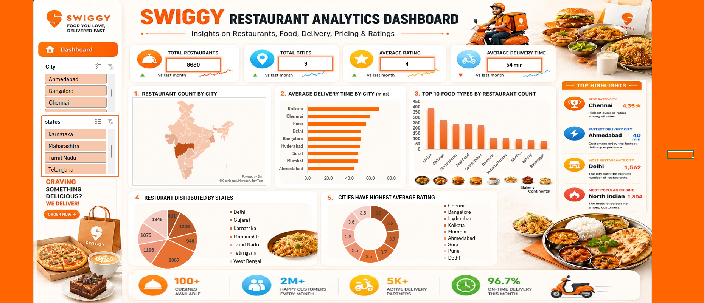
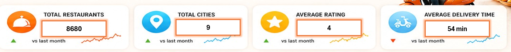
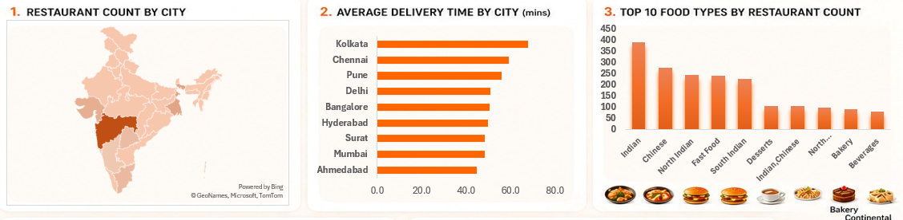
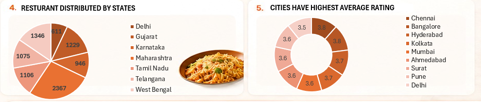
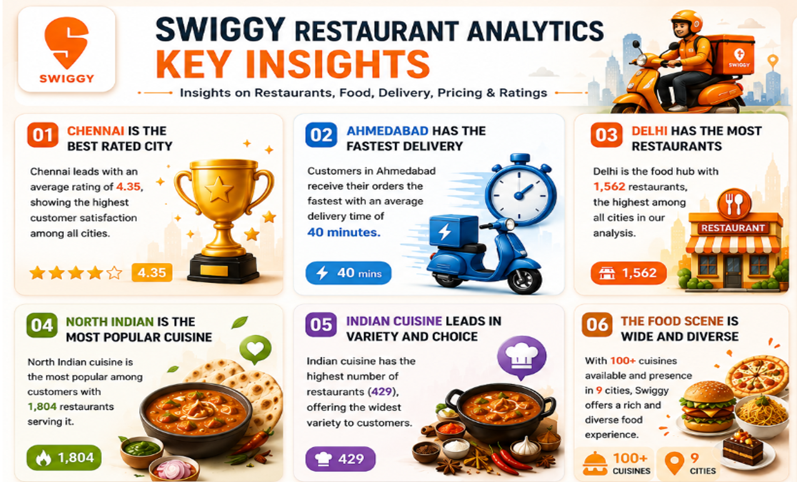

<div align="center">

#  Swiggy Restaurant Analytics Dashboard

### Turning restaurant, delivery, cuisine and rating data into actionable insights

<p>
  
  
  
  
</p>

<p>
  <b>📊 8,680 Restaurants</b> &nbsp;•&nbsp;
  <b>📍 9 Cities</b> &nbsp;•&nbsp;
  <b>⭐ 4.0 Avg. Rating</b> &nbsp;•&nbsp;
  <b>🛵 54 min Avg. Delivery</b>
</p>

</div>

---

## 📌 Project Overview

The **Swiggy Restaurant Analytics Dashboard** is a visual analytics project designed to explore restaurant distribution, food categories, delivery performance, ratings and geographic patterns across major Indian cities and states.

The dashboard transforms restaurant-level information into an executive-friendly view that helps answer questions such as:

- 🏙️ Where are restaurants concentrated?
- 🛵 Which cities have faster or slower delivery?
- 🍛 Which food categories have the largest restaurant presence?
- ⭐ Which cities report the highest average ratings?
- 🗺️ How are restaurants distributed across states?
- 🔎 What patterns stand out for business and customer experience?

> **Note:** This repository is a dashboard showcase built from the supplied project visuals. The raw source dataset and editable dashboard file are not included in this package.

---

## 🖼️ Dashboard Preview

### Executive Dashboard



The dashboard combines KPI cards, geographic analysis, delivery-time comparisons, food-type distribution, state-level restaurant counts and city ratings into a single executive view.

---

## 🎯 Project Objectives

| Objective | What it explores |
|---|---|
| 🏪 Restaurant Distribution | Restaurant concentration by city and state |
| 🛵 Delivery Performance | Average delivery time across cities |
| 🍜 Food Preferences | Restaurant counts by food type |
| ⭐ Customer Experience | Average ratings by city |
| 🗺️ Geographic Patterns | Regional concentration across India |
| 💡 Business Insights | High-level observations for decision-making |

---

## 📊 Key Performance Indicators



| KPI | Dashboard Value | Interpretation |
|---|---:|---|
| 🏪 Total Restaurants | **8,680** | Overall restaurant footprint represented in the dashboard |
| 📍 Total Cities | **9** | Geographic coverage across nine cities |
| ⭐ Average Rating | **4.0** | Overall average rating shown on the dashboard |
| 🛵 Average Delivery Time | **54 min** | Overall average delivery time shown on the dashboard |

---

## 🔍 Dashboard Analysis

### 1. 🏙️ Restaurant Count by City



The city-level analysis highlights differences in restaurant availability and delivery performance across the nine covered cities.

The dashboard's highlight panel identifies **Delhi** as the city with the highest restaurant count, at **1,562 restaurants**.

**Why this matters:**  
Restaurant density can indicate the scale of a local food ecosystem, while also providing context for competition, cuisine variety and customer choice.

---

### 2. 🛵 Average Delivery Time by City

The dashboard compares delivery performance across:

**Kolkata → Chennai → Pune → Delhi → Bangalore → Hyderabad → Surat → Mumbai → Ahmedabad**

The key-insight panel identifies **Ahmedabad** as the fastest-delivery city in the dashboard, with an average delivery time of **40 minutes**.

**Analytical takeaway:**  
Delivery time is an important operational metric because it connects restaurant availability, delivery-partner efficiency, distance and customer experience.

---

### 3. 🍜 Top Food Types by Restaurant Count

The food-type analysis shows **Indian cuisine** as the largest category by restaurant count, followed by categories such as Chinese, North Indian, Fast Food and South Indian.

The dashboard also highlights **North Indian cuisine** as the most popular cuisine segment, with **1,804 restaurants** serving it.

**Analytical takeaway:**  
The food ecosystem is broad, but Indian and closely related regional cuisines form a major part of the restaurant landscape represented here.

---

### 4. 🗺️ Restaurant Distribution by State



The state-level visualization shows the following restaurant counts:

| State | Restaurants |
|---|---:|
| Maharashtra | **2,367** |
| West Bengal | **1,346** |
| Gujarat | **1,229** |
| Tamil Nadu | **1,106** |
| Telangana | **1,075** |
| Karnataka | **946** |
| Delhi | **611** |

**Observation:**  
Maharashtra represents the largest state-level restaurant count in the dashboard, followed by West Bengal and Gujarat.

---

### 5. ⭐ City Rating Analysis

The dashboard compares average ratings across the nine cities.

The key-insight panel identifies **Chennai** as the highest-rated city, with an average rating of **4.35**.

**Analytical takeaway:**  
High restaurant density and high customer ratings are separate dimensions. A city can have a large restaurant ecosystem while another city may lead on average customer ratings.

---

# 💡 Key Insights



### 🥇 01 — Chennai leads on average rating

**4.35 ⭐**

Chennai is highlighted as the highest-rated city in the dashboard.

This suggests that the restaurants represented in Chennai receive strong average customer ratings relative to the other cities covered.

---

### ⚡ 02 — Ahmedabad has the fastest delivery

**40 minutes 🛵**

Ahmedabad is highlighted as the fastest city by average delivery time.

This makes delivery efficiency one of the notable differentiators in the dashboard's city comparison.

---

### 🏙️ 03 — Delhi has the largest restaurant count

**1,562 restaurants 🏪**

Delhi has the highest city-level restaurant count in the dashboard.

This indicates a large and diverse restaurant ecosystem within the analyzed city set.

---

### 🍛 04 — North Indian cuisine has the largest highlighted cuisine presence

**1,804 restaurants**

North Indian cuisine is highlighted as the most popular cuisine segment by restaurant presence.

---

### 🍽️ 05 — Indian cuisine has broad restaurant representation

The dashboard's key-insight panel reports **429 restaurants** for the highlighted Indian cuisine category.

This reinforces the strong representation of Indian food in the analyzed restaurant landscape.

---

### 🌍 06 — The food ecosystem is broad and diverse

The dashboard represents:

- **100+ cuisines**
- **9 cities**
- **8,680 restaurants**

Together, these metrics illustrate a wide restaurant and cuisine ecosystem.

---

## 📈 Insight Summary

| Area | Finding | Business Meaning |
|---|---|---|
| ⭐ Ratings | Chennai — **4.35** | Strong average customer rating |
| 🛵 Delivery | Ahmedabad — **40 min** | Fastest highlighted delivery performance |
| 🏪 City scale | Delhi — **1,562** | Largest restaurant count among covered cities |
| 🍛 Cuisine | North Indian — **1,804** | Largest highlighted cuisine presence |
| 🗺️ State scale | Maharashtra — **2,367** | Largest state-level restaurant count |
| 🌍 Coverage | **9 cities / 100+ cuisines** | Broad geographic and culinary diversity |

---

## 🧭 How to Read the Dashboard

The dashboard is organized into five analytical layers:

```text
                    SWIGGY RESTAURANT ANALYTICS
                              │
        ┌─────────────────────┼─────────────────────┐
        │                     │                     │
     LOCATION              OPERATIONS           CUSTOMER
        │                     │                     │
   City / State          Delivery Time          Ratings
        │                     │                     │
        └─────────────────────┼─────────────────────┘
                              │
                         FOOD ECOSYSTEM
                              │
                   Cuisine / Food Types
                              │
                              ▼
                         KEY INSIGHTS
```

This structure makes it possible to move from **high-level KPIs → geographic patterns → operational metrics → food categories → customer ratings → conclusions**.

---

## 🧩 Dashboard Components

### KPI Cards
- Total Restaurants
- Total Cities
- Average Rating
- Average Delivery Time

### Visual Analytics
- 🗺️ Restaurant count by city
- 📊 Average delivery time by city
- 🍜 Top food types by restaurant count
- 🥧 Restaurant distribution by state
- 🍩 Average rating by city

### Insight Layer
- Best-rated city
- Fastest delivery city
- City with most restaurants
- Most represented cuisine
- Overall cuisine diversity

---

## 🛠️ Suggested Technology Stack

The repository is intentionally focused on the **dashboard and visual storytelling assets**. If you publish the editable implementation alongside it, document the exact tools used in your project.

A typical implementation can include:

```text
📊 BI / Visualization
   └── Power BI / Tableau / Excel

🧹 Data Preparation
   └── Excel / Power Query / Python / SQL

📁 Data Storage
   └── CSV / Excel / SQL Database

🐙 Version Control
   └── Git + GitHub
```

> Replace the technology names above with the exact tools used to build your original dashboard if you add the source files later.

---

## 📂 Repository Structure

```text
swiggy-restaurant-analytics/
│
├── README.md
│
└── assets/
    ├── dashboard_overview.png
    ├── kpi_snapshot.png
    ├── city_delivery_food_types.png
    ├── state_and_rating_analysis.png
    └── key_insights.png
```

---

## 🚀 How to Use This Repository

### 1. Clone the repository

```bash
git clone https://github.com/<your-username>/swiggy-restaurant-analytics.git
cd swiggy-restaurant-analytics
```

### 2. Open the README

GitHub automatically renders the dashboard screenshots and project documentation.

### 3. Add your editable dashboard

If you have the original `.pbix`, `.twb`, `.xlsx`, `.ipynb` or source-code files, add them to a suitable folder such as:

```text
dashboard/
data/
notebooks/
src/
```

### 4. Add the source dataset

If the dataset can legally be redistributed, place it under:

```text
data/
```

Otherwise, document the dataset source and access instructions without committing restricted data.

---

## 🔬 Recommended Future Enhancements

To take this project from a dashboard showcase to a complete analytics portfolio project, consider adding:

- 📅 Time-series analysis of orders and delivery performance
- 💰 Pricing and cost analysis
- 🧾 Average order value analysis
- ⭐ Rating distribution instead of only average ratings
- 🛵 Delivery-time segmentation
- 🏙️ City-level cuisine preference analysis
- 🗺️ Interactive map with drill-down
- 📈 Trend analysis by month or quarter
- 🤖 Predictive analysis for delivery time or ratings
- 🧠 Customer segmentation
- 🔄 Automated data refresh pipeline

---

## ⚠️ Data & Interpretation Notes

- The metrics in this README are based on the supplied dashboard visuals.
- Some chart labels are rounded or visually presented as categories rather than exact underlying values.
- **8,680 restaurants**, **9 cities**, **4.0 average rating**, **54-minute average delivery time**, **Chennai 4.35**, **Ahmedabad 40 minutes**, **Delhi 1,562**, **North Indian 1,804**, and **Maharashtra 2,367** are values explicitly highlighted in the supplied dashboard visuals.
- The dashboard should be treated as an analytical representation of the underlying dataset rather than as a live Swiggy operational system.
- If the underlying dataset is added later, document its source, date, licensing terms and transformation steps.

---

## 🏁 Conclusion

The **Swiggy Restaurant Analytics Dashboard** provides a compact view of the restaurant ecosystem through four major lenses:

**📍 Geography + 🛵 Delivery + 🍛 Food + ⭐ Ratings**

The analysis highlights meaningful differences between cities and states. **Delhi** stands out for restaurant scale, **Ahmedabad** for highlighted delivery speed, **Chennai** for average rating, and **North Indian cuisine** for restaurant presence. At the broader level, the dashboard demonstrates a large and diverse food ecosystem spanning **8,680 restaurants, 9 cities and 100+ cuisines**.

The project can serve as a strong foundation for deeper restaurant analytics, operational optimization and customer-experience analysis.

---

## 👤 Author

**Sahil Arya**  
📊 Data Analytics / Business Intelligence Portfolio Project

---

<div align="center">

**Built with 📊 data, 🍛 food insights & 🛵 delivery analytics.**

</div>
